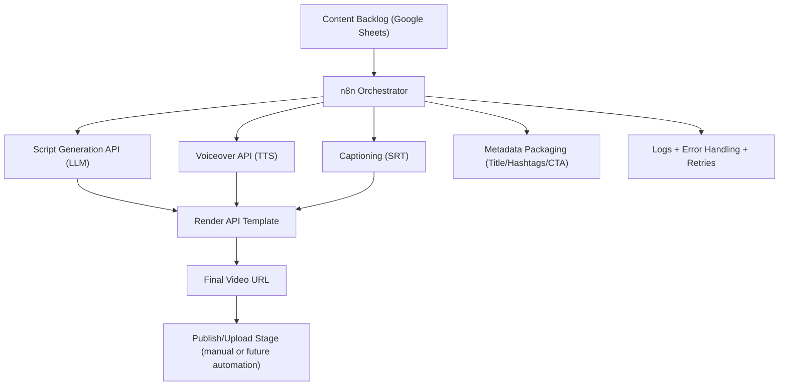

## High-level flow

1. **Webhook trigger** (or scheduled pull from Sheets)
2. **Normalize input** (validate fields, set defaults)
3. **LLM generation** → script + title + CTA
4. **TTS generation** → produces `voiceover_url`
5. **Render API** → returns `job_id`, then `final_video_url`
6. **Store results** in Google Sheets (run_id, status, URLs, errors)
7. **Notify** via Discord / Slack / Email (optional)

## Key design choices

- **run_id per execution** for full traceability across workflow steps and APIs  
- **Idempotency key** prevents duplicate renders if the workflow retries or replays  
- **Retry + exponential backoff** for external API calls (LLM, TTS, Render)  
- **Separation of concerns**
  - generation layer → LLM / TTS / captions  
  - rendering layer → Render API template  
  - storage layer → Google Sheets acting as a lightweight database

## Data stored in Google Sheets (minimum schema)

- `run_id`
- `status` (queued | generating | rendering | complete | failed)
- `input_source` (idea/topic)
- `voiceover_url`
- `render_job_id`
- `final_video_url`
- `error_message`
- `created_at`
- `updated_at`

## Failure handling

- **LLM or TTS failure**
  - workflow marks status = `failed`
  - error stored in sheet
  - optional notification triggered

- **Render API timeout**
  - status = `rendering_stuck`
  - workflow retries polling later

- **Webhook replay / duplicate trigger**
  - idempotency key prevents duplicate video renders
